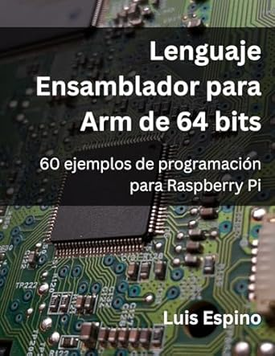
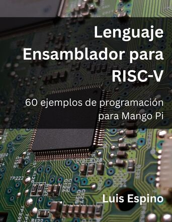

# Assembly Programming

## Assembly examples

[AArch32](arm32)

[AArch64](arm64)

[RISC-V](risc-v)

## Assembly Guides

[Emulate AArch64 on Android](emulate-archlinux-arm64-on-android)

[Emulate RaspiOS en QEMU](emulate-raspios-arm64-on-qemu)

[Run AArch64 assembly files on Arch Linux x86-64](https://luisespino.github.io/linux-handbook/ArchLinux/Assemble-AArch64/)

[Run AArch64 assembly files on Debian/Ubuntu x86-64](https://luisespino.github.io/linux-handbook/Debian-Ubuntu/Assemble-AArch64/)

## Reference

